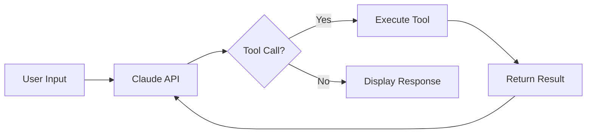

<div align="center">
  

  # sandbox-google-places-api

  [](https://www.python.org/downloads/)
  [](LICENSE)
  [](https://developers.google.com/maps)
  [](https://www.anthropic.com/)

  **An AI-powered chatbot that discovers places around you using natural conversation and Google Places API**

  [Features](#features) · [Quick Start](#quick-start) · [Usage](#usage) · [Architecture](#architecture)
</div>

---

## Features

- **Natural Language Place Search** - Ask about restaurants, cafes, or any place type in plain English
- **Automatic Geocoding** - Mention a location and it's automatically converted to coordinates
- **Memory System** - The chatbot remembers your location and preferences across the conversation
- **Place Details** - Get comprehensive information including ratings, hours, phone numbers, and websites
- **Smart Filtering** - Filter by price level, open status, distance, and keywords
- **50+ Place Types** - Search for restaurants, museums, parks, hospitals, and many more

## Quick Start

```bash
# Clone and setup
git clone https://github.com/tsilva/sandbox-google-places-api.git
cd sandbox-google-places-api

# Create conda environment
conda env create -f environment.yml
conda activate sandbox-google-places-api

# Configure API keys
cp .env.example .env
# Edit .env with your GOOGLE_MAPS_API_KEY and ANTHROPIC_API_KEY

# Run the chatbot
python chatbot.py
```

## Usage

### Interactive Chatbot

The chatbot understands natural language and automatically handles location context:

```
You: I'm in Porto, Portugal
ChatBot: [Geocodes "Porto, Portugal" and saves coordinates to memory]

You: Find me some good restaurants nearby
ChatBot: [Searches nearby using saved coordinates, returns restaurant list]

You: Tell me more about the first one
ChatBot: [Fetches detailed info: ratings, hours, phone, website]
```

### Simple API Example

For direct Google Places API usage without the chatbot:

```python
python main.py
```

This demonstrates a basic nearby search for restaurants in New York City.

## Configuration

Create a `.env` file with your API keys:

| Variable | Required | Description |
|----------|----------|-------------|
| `GOOGLE_MAPS_API_KEY` | Yes | [Google Cloud Console](https://console.cloud.google.com/apis/credentials) |
| `ANTHROPIC_API_KEY` | Yes | [Anthropic Console](https://console.anthropic.com/) |

## Architecture

### Tool System

The chatbot implements Anthropic's tool calling pattern with these capabilities:

| Tool | Description |
|------|-------------|
| `tool_geocode` | Converts addresses to lat/lng coordinates |
| `tool_places_nearby` | Searches for places with extensive filtering |
| `tool_place_details` | Retrieves detailed place information |
| `tool_save_memory` | Stores information across the conversation |
| `tool_delete_memory` | Removes stored memories |
| `tool_calculator` | Basic arithmetic operations |
| `tool_weather` | Weather information (mock data) |

### Conversation Flow



### Key Implementation Details

- **Prompt Caching** - System prompt uses `cache_control: {"type": "ephemeral"}` for efficiency
- **Dynamic Memory** - Up to 5 memories stored and included in system prompt
- **Tool Definitions** - JSON schema format for input validation
- **Error Handling** - Graceful handling of API failures

## Place Search Parameters

The `tool_places_nearby` supports extensive filtering:

| Parameter | Type | Description |
|-----------|------|-------------|
| `location` | object | `{latitude, longitude}` coordinates |
| `radius` | integer | Search radius in meters (1-50000) |
| `keyword` | string | Match against all indexed content |
| `place_type` | string | One of 50+ supported types |
| `min_price` / `max_price` | integer | Price level filter (0-4) |
| `open_now` | boolean | Only currently open places |
| `rank_by` | string | `"prominence"` or `"distance"` |

## License

MIT

---

<div align="center">
  Built with Google Maps Platform and Claude API
</div>
