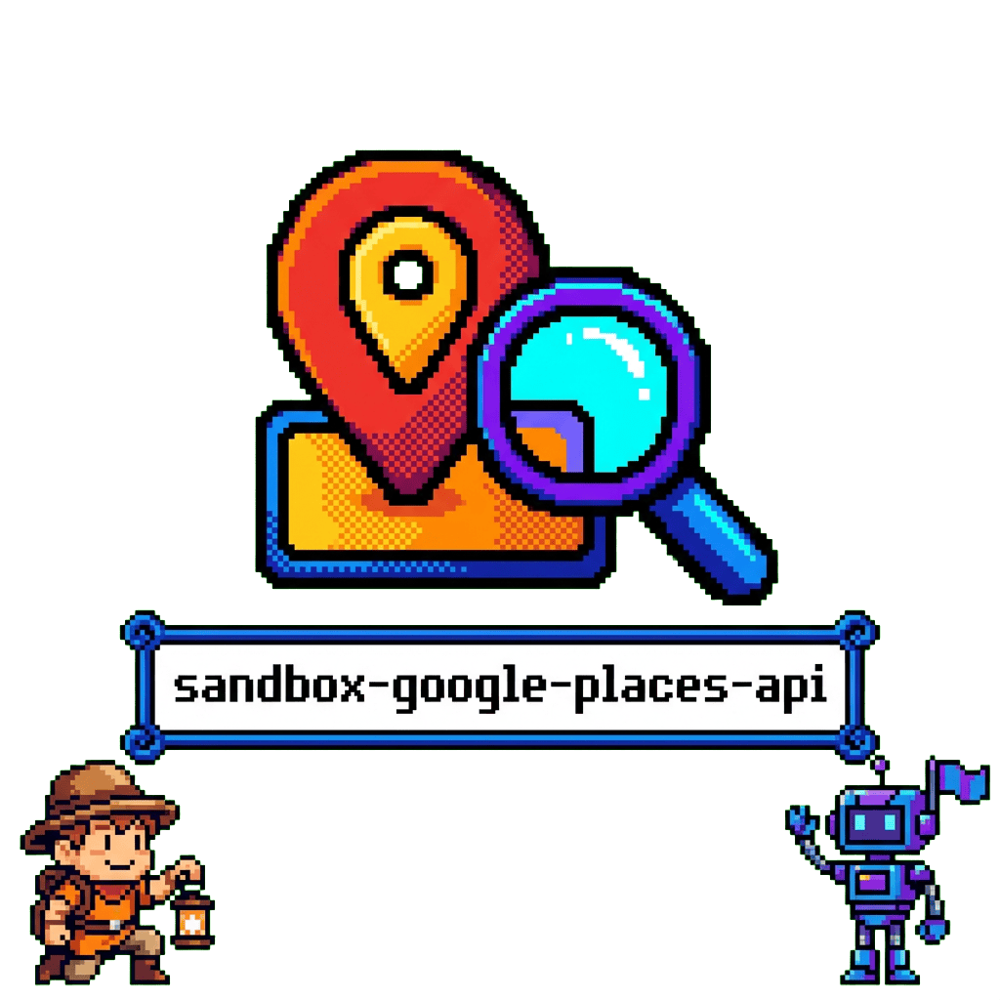

<div align="center">
  

  **📍 Experiment with Google Places API and Claude tool calling 🗺️**

</div>

## Overview

A sandbox environment for experimenting with Google Places API using Python. Features an interactive chatbot powered by Claude that can search for places, geocode addresses, and maintain conversational memory.

## Features

- **Places search** - Nearby search with filtering (radius, keywords, price, type)
- **Geocoding** - Convert addresses to coordinates
- **Place details** - Retrieve detailed information about places
- **Memory management** - Chatbot remembers user information across turns
- **Tool calling** - Claude-powered conversational interface with tools

## Quick Start

```bash
# Clone and setup
git clone https://github.com/tsilva/sandbox-google-places-api.git
cd sandbox-google-places-api

# Create environment
conda env create -f environment.yml
conda activate sandbox-google-places-api

# Configure API keys
cp .env.example .env
# Edit .env with GOOGLE_MAPS_API_KEY and ANTHROPIC_API_KEY

# Run simple example
python main.py

# Run interactive chatbot
python chatbot.py
```

## Available Tools

| Tool | Description |
|------|-------------|
| `tool_geocode` | Convert addresses to lat/lng coordinates |
| `tool_places_nearby` | Search for nearby places with filters |
| `tool_place_details` | Get detailed place information |
| `tool_save_memory` | Store user information |
| `tool_delete_memory` | Remove stored memories |
| `tool_calculator` | Basic arithmetic |

## Requirements

- Python 3.9
- Conda
- Google Maps API key
- Anthropic API key

## License

MIT
